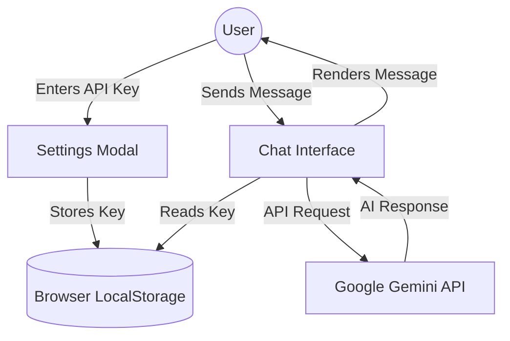

# 🚀 Google Chennai API Tester - Premium Chat Interface

A high-performance, professional AI chatbot interface built to test the capabilities of the **Google Chennai API** (powered by Gemini 1.5 Flash). This tool is designed for developers and testers to explore API limits, response speeds, and integration patterns in a secure, client-side environment.

## 🧪 Project Objective
The primary goal of this project is to provide a "Zero-Backend" testing environment for the **Google Chennai API**. Unlike typical AI apps, this project **does not store any API keys on any server**. Instead, it allows users to manually enter their own keys, which are stored securely in their browser's local storage for testing purposes.

---

## 🛠️ Project Architecture



---

## ✨ Key Testing Features
- **Manual API Key Entry**: Users can paste their own Google AI Studio keys to test connectivity.
- **Client-Side Security**: No keys are ever uploaded or stored in environment files. Everything happens in your browser.
- **Limit Testing**: Easily observe how the Gemini 1.5 Flash model behaves under different account tiers and quotas.
- **Dark/Light Mode**: Premium UI testing across different visual environments.
- **Auto-Scroll & Persistence**: Messages and settings persist across session refreshes.

---

## 🛠️ Technology Stack & Sector Details

### 1. **Frontend Architecture**
- **React 19**: Utilizing the latest concurrent rendering features for a smooth, lag-free UI.
- **Vite 8**: Providing the fastest development and build cycles available in the modern JS ecosystem.

### 2. **Design System**
- **Tailwind CSS v4**: Implementing a robust utility-first design system with custom HSL color tokens.
- **Framer Motion**: Powering all micro-interactions, layout transitions, and entry animations.

### 3. **AI Logic Sector**
- **Google Generative AI SDK**: Optimized wrapper for the `gemini-1.5-flash` model.
- **Error Handling Sector**: Custom logic to capture and display API-specific errors (Quota limits, Invalid keys, etc.).

---

## 🚀 How to Use (GitHub Pages)
1. **Open the App**: Navigate to your deployed GitHub Pages URL.
2. **Configure API**: Click the **Settings (Gear Icon)** or wait for the automatic prompt.
3. **Paste Your Key**: Enter your API key from [Google AI Studio](https://aistudio.google.com/).
4. **Start Chatting**: The bot will only activate once a valid key is provided.

---

## 📂 Local Development
1. **Clone the Repository**
2. **Install Dependencies**:
   ```bash
   npm install
   ```
3. **Run App**:
   ```bash
   npm run dev
   ```

---

## 🏷️ Recommended Repository Names
- `google-chennai-api-tester`
- `gemini-key-tester`
- `perfect-ai-interface`
- `chennai-flash-hub`

---

*This project is purely for testing and educational purposes regarding Google's Generative AI infrastructure. Developed with precision to ensure a perfect testing experience.*
