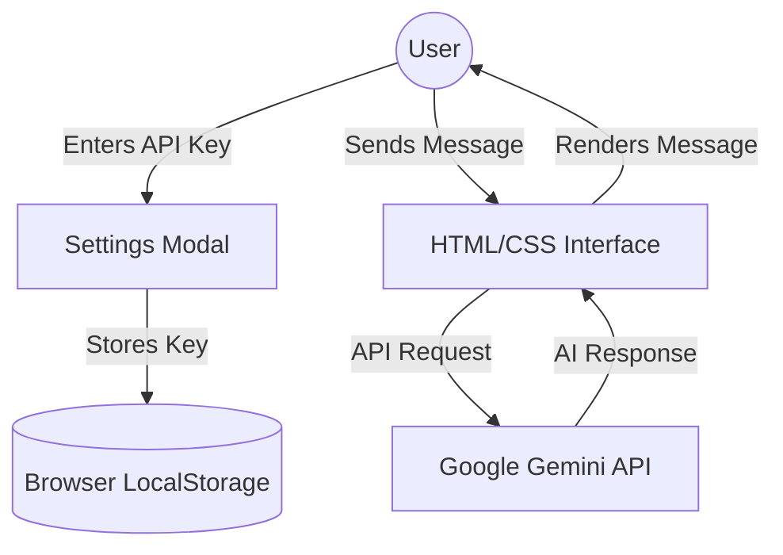

# 🚀 Google Chennai API Tester - Static HTML/CSS Edition

A high-performance, ultra-premium AI chatbot interface built to test the **Google Chennai API** (Gemini 1.5 Flash). This website is built entirely using **HTML, CSS, and Vanilla JavaScript**, making it lightning-fast, secure, and ready for instant deployment on GitHub Pages.

## 🧪 Project Objective
The primary goal of this project is to provide a "Zero-Install" testing environment for the **Google Chennai API**. This website requires **no Node.js, no NPM, and no installation**. Simply open the `index.html` file in any browser to start testing.

---

## 🛠️ Project Architecture

---

## ✨ Key Features
- **Pure HTML & CSS**: No complex build tools or dependencies.
- **Instant Deployment**: Designed specifically for **GitHub Pages**.
- **Manual API Key Entry**: Users paste their own Google AI Studio keys for testing.
- **Client-Side Security**: No keys are ever stored on a server. Everything happens in the browser.
- **Premium Design**: Built with Tailwind CSS, Lucide Icons, and custom Glassmorphism effects.
- **Dark Mode Support**: Seamlessly switch between light and dark aesthetics.

---

## 🛠️ Technology Stack
- **HTML5**: Semantic structure.
- **CSS3 (Tailwind)**: Modern, responsive styling via CDN.
- **Vanilla JavaScript**: Lightweight logic for API communication.
- **Lucide Icons**: Professional vector iconography via CDN.

---

## 🚀 How to Deploy on GitHub Pages
1. **Upload Files**: Simply push this `index.html` file and its assets to your GitHub repository.
2. **Enable Pages**: Go to **Settings > Pages** and select the `main` branch as the source.
3. **Go Live**: Your website will be live at `https://yourusername.github.io/your-repo-name`.

---

## 📂 Local Usage
1. **Clone the Repository**
2. **Open the File**: Double-click `index.html` to run the app instantly.

*Note: No installation required. No NPM needed.*

---

## 🏷️ Recommended Repository Names
- `google-chennai-api-tester`
- `static-ai-interface`
- `html-css-gemini-tester`

---

*This project is built for professional testing of Google's AI infrastructure with a focus on simplicity and performance.*
