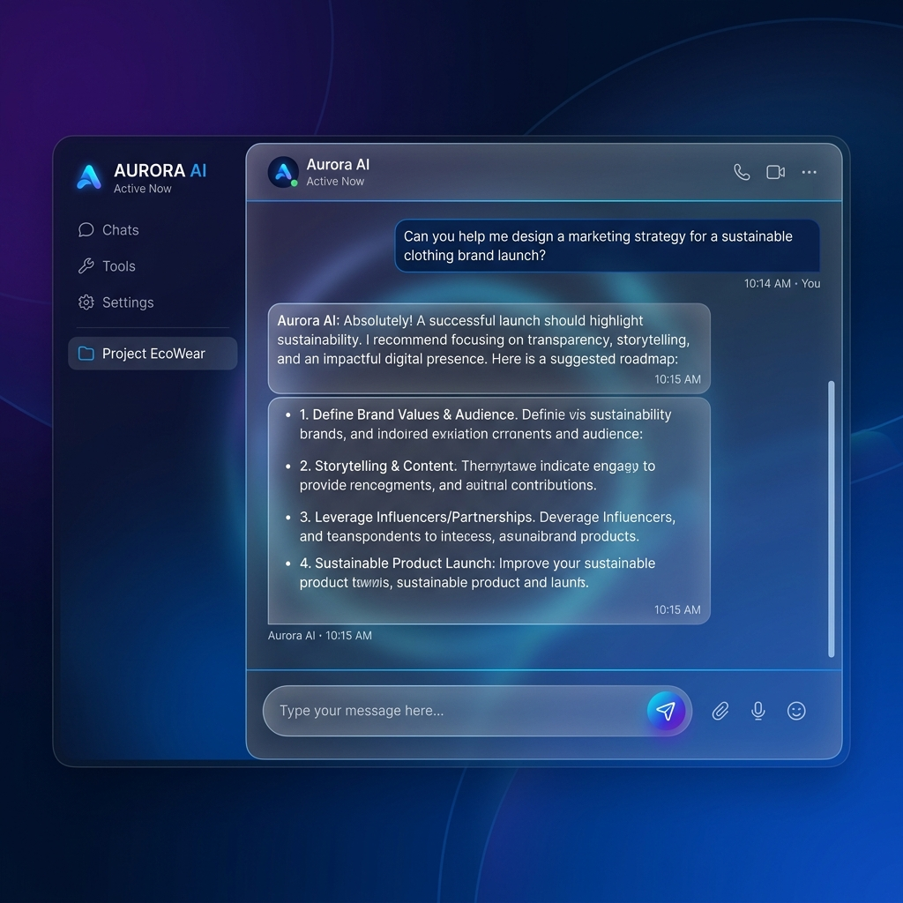
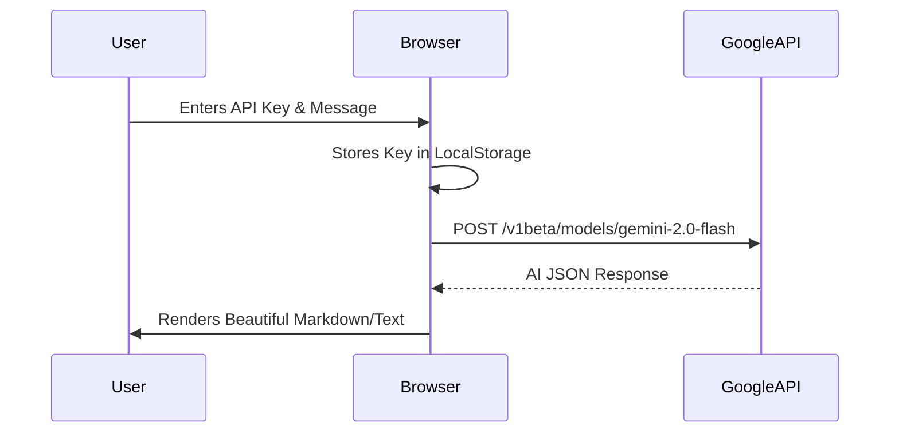

# 🌟 Chennai AI Tester
### *The Ultimate Gemini 2.0 Flash Testing Suite*

[](https://github.com/blazecodeprakhar/google-chennai-api-tester)
[](https://opensource.org/licenses/MIT)
[](https://developer.mozilla.org/en-US/docs/Web/HTML)

Chennai AI Tester is a **premium, zero-dependency** web interface designed for high-performance interaction with the Google Gemini 2.0 API. Built with a focus on speed, privacy, and aesthetic excellence, it allows you to test AI prompts instantly without any local setup or installation.



---

## ✨ Premium Features

- **🚀 Instant Launch**: No `npm install`, no `node_modules`. Just open `index.html`.
- **🎨 Glassmorphism Design**: A sleek, modern UI with `backdrop-filter` effects and smooth transitions.
- **🌗 Smart Dark Mode**: Seamlessly toggle between light and dark themes with system preference detection.
- **🔒 Privacy Centric**: Your API keys are stored only in your browser's `localStorage`. No server ever sees your data.
- **⚡ Optimized for Gemini 2.0**: Pre-configured to leverage the latest high-speed Gemini Flash models.
- **📱 Fully Responsive**: Works perfectly on Desktops, Tablets, and Smartphones.

---

## 🛠️ How It Works



---

## 🚀 Getting Started

### 1. Installation
Simply clone the repository and you are ready to go:
```bash
git clone https://github.com/blazecodeprakhar/google-chennai-api-tester.git
```

### 2. Usage
- Open `index.html` in your favorite browser (Chrome, Edge, Brave, Safari).
- Click the **Settings** icon.
- Paste your **Google AI Studio Key** (Get one [here](https://aistudio.google.com/)).
- Start chatting!

### 3. Deploy to GitHub Pages
This project is **built for GitHub Pages**. 
1. Push to your repo.
2. Go to `Settings > Pages`.
3. Enable it for the `main` branch.
4. Your site is live!

---

## 🛠️ Tech Stack
- **Structure**: Semantic [HTML5](https://developer.mozilla.org/en-US/docs/Web/HTML)
- **Styling**: [Tailwind CSS](https://tailwindcss.com/) (Modern Utility-first CSS)
- **Icons**: [Lucide Icons](https://lucide.dev/) (Clean Vector Icons)
- **Engine**: Vanilla JavaScript (ES6+)
- **API**: Google Generative AI (Gemini)

---

## 📄 License
This project is licensed under the MIT License - see the [LICENSE](LICENSE) file for details.

---

<div align="center">
  <p>Built with precision by <b>Blazecode Prakhar</b></p>
  <a href="https://github.com/blazecodeprakhar">
    
  </a>
</div>
